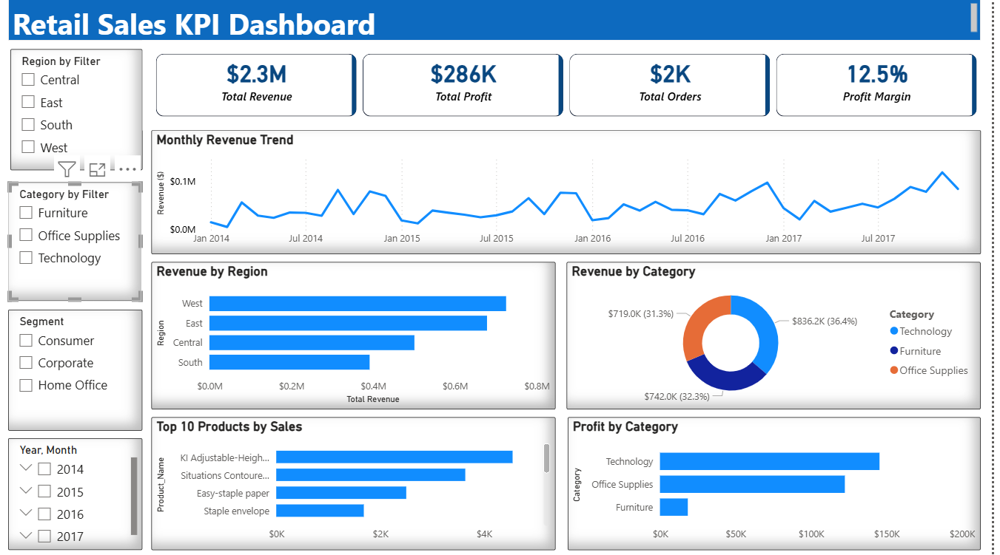

# Sales Performance Dashboard (Power BI)

## Project Overview
This project analyzes sales performance using the Superstore dataset.  
The goal of the dashboard is to identify revenue trends, regional performance, and product profitability.

The dashboard was built using Power BI with data transformation in Power Query and KPI calculations using DAX.

## Dataset used
[Superstore Dataset](superstore_dataset.xlsx)

---

## Power BI Dashboard File
[Download Power Bi Dashboard](sales_dashboard.pbix)

---

## Dashboard Preview

---

## Tools Used
- Power BI
- Power Query
- DAX
- Excel

---

## Dashboard Features
The dashboard includes the following key metrics and visualizations:

- Total Revenue
- Total Profit
- Total Orders
- Profit Margin
- Monthly Revenue Trend
- Revenue by Region
- Revenue by Category
- Top 10 Products by Sales
- Profit by Category

---

## Key Insights
- Technology generates the highest revenue among product categories.
- Furniture produces lower profit compared to other categories.
- The West region leads overall sales performance.
- Monthly sales trends show overall growth with seasonal variation.

---

## Files Included
- Power BI dashboard (.pbix)
- Dataset used for analysis
- Dashboard screenshot

